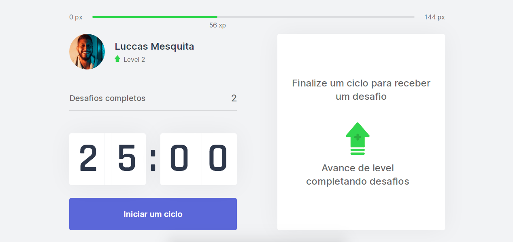
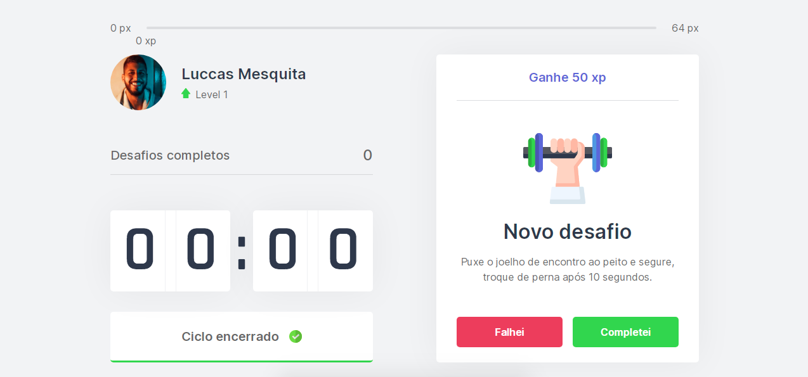
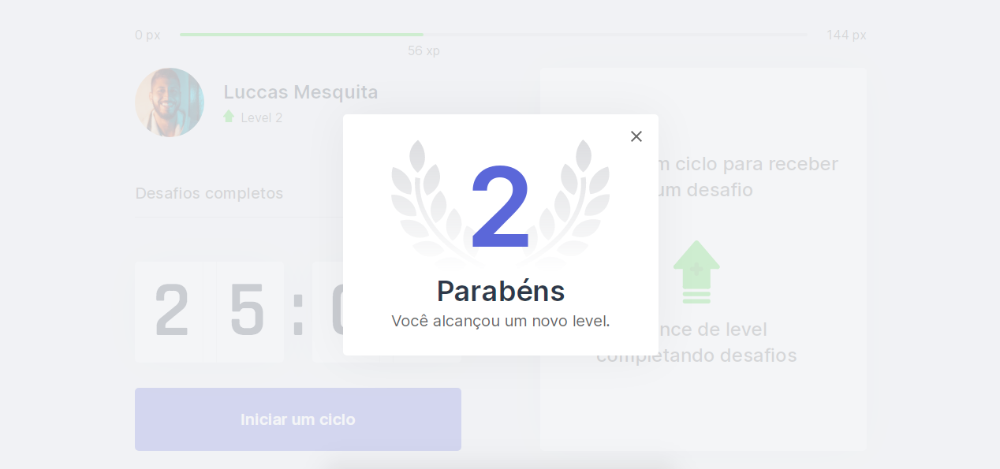

## About

The developed application is a stopwatch to use the POMODORO technique for the end of each cycle the user receives a challenge for an exercise. Thinking of helping to decrease the chances of an injury or future illness due to lack of movement.

Project developed during the NLW event # 04 - ROCKETSEAT's React Trail creating this web application.

## Screenshots

<div align="center" id="top"> 
  
</div>
<br/>
<br/>
<div align="center" id="top"> 
  
</div>
<br/>
<br />
<div align="center" id="top"> 

</div>
<br/>

## Preview

[](https://moveit-luccasmesquita.vercel.app/)


## Technologies

The following tools were used in this project:

- [Next](https://nextjs.org/)
- [React](https://pt-br.reactjs.org/)
- [TypeScript](https://www.typescriptlang.org/)

## Requirements

Before starting, you need to have [Git](https://git-scm.com) and [Node](https://nodejs.org/en/) installed.

## Starting

```bash

# Clone this project

$ git clone https://github.com/luccasmesquita/move-it
# Access

$ yarn
# Run the project

$ yarn start
# The server will initialize in the <http://localhost:3000>

```


<a href="https://github.com/luccasmesquita" target="_blank">Luccas Mesquita</a>


&#xa0;


<a href="#top">Back to top</a>
